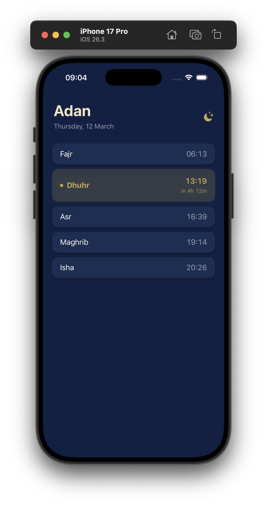
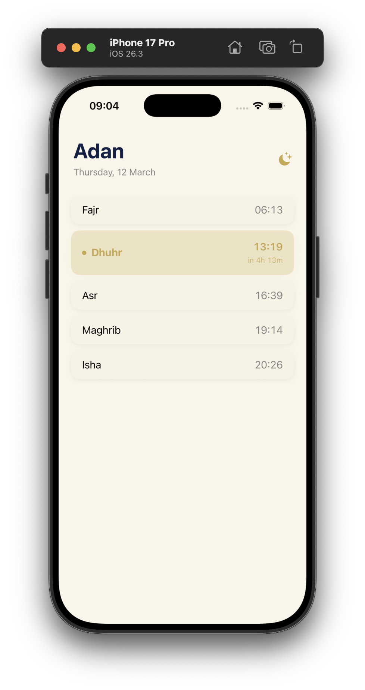
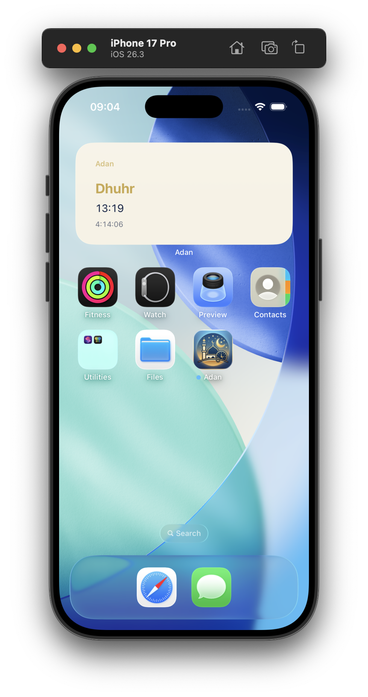

# Adan — Prayer Times App

A clean iOS app and widget that shows daily prayer times based on your real location.

  

---

## Features

- **Real location** — uses CoreLocation to fetch accurate prayer times for wherever you are
- **Live countdown** — shows time remaining until the next prayer
- **Home screen widget** — glanceable next prayer with a live timer, no need to open the app
- **Adaptive design** — follows system dark/light mode with a navy and gold palette
- **Offline fallback** — if the network is unavailable, falls back to cached times from the last successful fetch

## Screenshots

| Dark Mode | Light Mode | Widget |
|-----------|------------|--------|
|  |  |  |

---

## Tech Stack

| Layer | Technology |
|-------|-----------|
| Language | Swift 6 |
| UI | SwiftUI |
| Location | CoreLocation |
| Networking | URLSession + async/await |
| Data | Codable, UserDefaults (App Groups) |
| Widget | WidgetKit |
| API | [Aladhan Prayer Times API](https://aladhan.com/prayer-times-api) |

---

## Project Structure

```
Adan/
├── AdanApp.swift          # App entry point
├── ContentView.swift      # Main screen
├── Models.swift           # PrayerTime struct + design system colors
├── PrayerService.swift    # API fetch, shared storage, helpers
├── LocationManager.swift  # CoreLocation wrapper
└── Assets.xcassets/       # App icon, colors

AdanWidget/
└── AdanWidget.swift       # WidgetKit timeline provider and views
```

---

## Getting Started

### Requirements

- Xcode 26+
- iOS 18+ deployment target
- An Apple Developer account (free tier works for personal device testing)

### Setup

1. Clone the repo
   ```bash
   git clone https://github.com/Ayman-aa/Adan.git
   cd Adan
   ```

2. Open `Adan.xcodeproj` in Xcode

3. In **Signing & Capabilities**, set your own bundle identifier and team for both the `Adan` and `AdanWidgetExtension` targets

4. Update the App Group identifier in `PrayerService.swift` to match your own:
   ```swift
   let appGroupID = "group.com.yourname.adan"
   ```
   Make sure the same group is set in **Signing & Capabilities** for both targets.

5. Run on simulator or device

---

## How It Works

The app fetches prayer times from the Aladhan API using your device's coordinates and saves them to a shared `UserDefaults` container (App Group). The widget reads from that same container — this avoids redundant network calls and works reliably since widgets can't make network requests directly in all conditions.

The widget refreshes its timeline once per day at midnight.

---

## Calculation Method

Uses **method 2** (Islamic Society of North America) from the Aladhan API. You can change this by updating the `method` parameter in `PrayerService.swift`:

```swift
"https://api.aladhan.com/v1/timings?latitude=\(lat)&longitude=\(lon)&method=2"
```

See the [Aladhan API docs](https://aladhan.com/prayer-times-api) for all available methods.

---

## License

MIT
